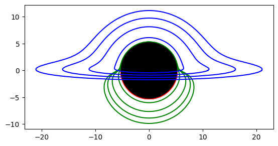

# Документация проекта: Рисование черной дыры

В этом ноутбуке мы исследуем свойства черных дыр и их влияние на окружающее пространство, используя методы дифференциальной геометрии и трассировку лучей. Черные дыры — это объекты, из которых ничего не может вырваться. Мы будем рассматривать черные дыры в рамках общей теории относительности, которая использует дифференциальную геометрию в качестве своего языка.

## Что мы делаем в этом ноутбуке

1. **Математическая основа**: Мы используем дифференциальные уравнения для описания геометрии черной дыры и того, как световые лучи взаимодействуют с ней.
2. **Трассировка лучей**: Мы научимся трассировать фотоны от аккреционного диска вокруг черной дыры до наблюдателя, находящегося на большом расстоянии.
3. **Визуализация**: Мы создадим визуализацию траекторий фотонов, чтобы увидеть, как они проходят мимо черной дыры.

### Настройка сцены

Мы будем настраивать сцену с черной дырой и аккреционным диском, состоящим из постоянных радиальных колец. Наблюдатель будет находиться очень далеко над черной дырой.

### Используемые библиотеки

В работе мы будем использовать следующие библиотеки:
- `scipy`
- `numpy`
- `matplotlib`

## Визуализация

Ниже представлена визуализация черной дыры и аккреционного диска:

